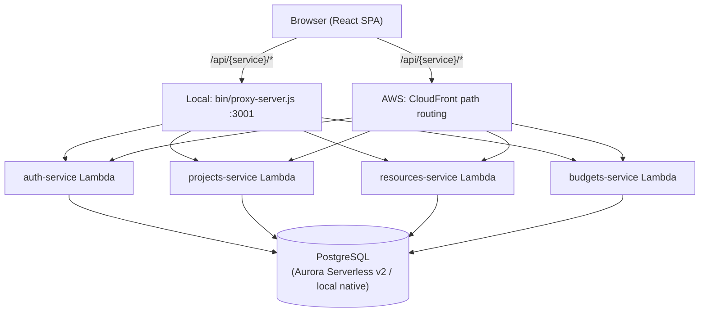

# Testing Plan — ACME Projects (Project Management Platform)

**Phase:** 1 — Project Analysis
**Status:** Complete
**Prepared by:** Inspection of the actual repository state on 2026-07-23 (no assumptions — every claim below was verified by reading source files, migration SQL, or running the code).

---

## 1. Application Overview

ACME Projects is a multi-tenant-shaped (single-workspace, per-deployment) **Project Management Platform**: project/deliverable tracking, dependency management, team resource allocation and workload, and budget planning/spend tracking, with a role-based dashboard.

**What exists today (verified):**

| Layer | State |
|---|---|
| Backend | 4 Lambda services, fully implemented CRUD + RBAC, hand-tested against live Postgres during development, **zero automated test files** |
| Frontend | React SPA, 5 routed pages + ~20 dialogs/components, feature-complete for Projects/Resources/Budgets/Dashboard, **32 Vitest tests across 9 files** |
| Database | 1 migration, 8 tables, fully normalized, constraints/indexes verified live |
| Infra | Terraform, deploys cleanly to LocalStack (verified this session, after fixing 4 real deployment bugs — see §9) |
| CI | 3 GitHub Actions workflows, **all security scanning only** (Bandit, npm audit, Checkov) — no test execution wired in |

**What does not exist:** any Playwright test, any JMeter test plan, any backend pytest, any CI job that runs a test suite, any seed/fixture data strategy, any `docs/testing/` documentation. This plan is the starting point for building all of that.

---

## 2. Architecture Summary

- **Backend pattern**: one Lambda per bounded context (not per table). Each `function.py` is a self-contained mini-router (`backend/_shared/router.py`) dispatching normalized `(method, path)` to handler functions. No framework (no Flask/FastAPI) — raw Lambda Function URL event handling.
- **Shared code**: `backend/_shared/` (db pooling, JWT/RBAC, validation, HTTP envelope, error types) is synced into each service's `_lib/` folder at deploy time by a Terraform `null_resource` — not a pip package. This is invisible to pytest unless tests add `_shared` to `sys.path` directly (important for Phase 5 design).
- **Database access**: raw SQL via `psycopg[binary]` (v3), no ORM. Dynamic `WHERE`/`ORDER BY` clauses are built from allow-listed column maps (never raw user input) — verified Bandit-clean, but a natural target for negative/injection-style API tests.
- **Frontend**: Vite + React 19 + MUI + TanStack Query + React Router 7, feature-folder architecture (`src/features/{auth,projects,resources,budgets,dashboard}`), route-level code-splitting via `React.lazy`.
- **Auth**: stateless JWT (HS256), no session store, no refresh-token revocation list currently persisted (the `refresh_tokens` table exists in the schema but is **not yet used** by any handler — worth flagging, see §9).
- **Local dev topology**: LocalStack (Lambda + S3 + CloudFront emulation) + native PostgreSQL + native MongoDB (unused by our services) + a hand-rolled Node CORS proxy, orchestrated by `bin/start-dev.sh`.

---

## 3. Frontend Modules

| Module | Path | Responsibility |
|---|---|---|
| App shell | `src/app/` | Router config, route-level lazy loading + Suspense, `ProtectedRoute` (auth gate), `ErrorBoundary` |
| Theme | `src/theme/` | MUI theme, light/dark mode (persisted to `localStorage`, respects `prefers-color-scheme`) |
| Layouts | `src/layouts/` | `AppLayout` (responsive sidebar/topbar, uses `react-responsive`), `AuthLayout` (centered card) |
| Shared components | `src/components/` | `EmptyState`, `PageHeader`, `StatusChip`, `ConfirmDialog`, `ErrorState`, `ListSkeleton`, `ToastProvider`, `RoleGuard` |
| Shared libs | `src/lib/` | `apiClient` (fetch wrapper, auto token-refresh-and-retry on 401), `tokenStore` (localStorage), `roles` (RBAC hierarchy mirror), `queryClient` (TanStack Query) |
| Hooks | `src/hooks/` | `useDebounce` |
| Feature: auth | `src/features/auth/` | `LoginPage`, `RegisterPage` (bootstrap-first-admin flow), `AuthContext`/`useAuth`, `api.js` |
| Feature: projects | `src/features/projects/` | `ProjectsPage` (list/filter/sort/paginate), `ProjectDetailPage` (deliverables CRUD, dependency manager, budget summary), `ProjectFormDialog`, `DeliverableFormDialog`, `DeliverableDependenciesDialog`, `ProjectPicker`, `hooks.js` (React Query), `constants.js` (enum→label/color maps) |
| Feature: resources | `src/features/resources/` | `ResourcesPage` (roster + workload cards), `ResourceAssignmentsDialog`, `AssignmentFormDialog`, `ResourcePicker`, `hooks.js` |
| Feature: budgets | `src/features/budgets/` | `BudgetsPage` (list + spend-by-category chart), `BudgetDetailDialog`, `BudgetFormDialog`, `BudgetEntryFormDialog`, `hooks.js` |
| Feature: dashboard | `src/features/dashboard/` | `DashboardPage` (stat cards, risk pie chart, budget burn, upcoming deadlines, overallocated-team chips) — aggregates data from all 3 other services' summary endpoints |

**Routes** (from `src/app/routes.jsx`):

| Path | Auth | Component |
|---|---|---|
| `/login` | public | `LoginPage` |
| `/register` | public | `RegisterPage` |
| `/` | protected | redirects to `/dashboard` |
| `/dashboard` | protected | `DashboardPage` |
| `/projects` | protected | `ProjectsPage` |
| `/projects/:id` | protected | `ProjectDetailPage` |
| `/resources` | protected | `ResourcesPage` |
| `/budgets` | protected | `BudgetsPage` |
| `*` | protected | redirects to `/dashboard` |

---

## 4. Backend Modules

| Module | Path | Responsibility |
|---|---|---|
| `db.py` | `backend/_shared/` | Pooled psycopg connection (module-level, reused across warm invocations), `transaction()` context manager (commit/rollback/reset-on-error) |
| `auth.py` | `backend/_shared/` | bcrypt hashing, JWT issue/decode (HS256, `JWT_SECRET` env var, fails closed if missing), `get_current_user`, `require_role`, `require_min_role` |
| `http_utils.py` | `backend/_shared/` | Lambda event parsing (`parse_event`), path normalization (handles CloudFront-vs-local-proxy prefix difference), response envelope (`success`/`no_content`/`error_response`), custom `JsonEncoder` (UUID/date/Decimal) |
| `validation.py` | `backend/_shared/` | `require_fields`, `validate_enum`, `validate_uuid`, `validate_date`, `validate_int`, `validate_decimal`, `parse_pagination`, `parse_sort` (allow-list based, injection-safe) |
| `router.py` | `backend/_shared/` | Regex-based path-pattern router; distinguishes 404 (no path match) from 405 (path matches, method doesn't) |
| `errors.py` | `backend/_shared/` | `ApiError` hierarchy: `ValidationError`(400), `AuthError`(401), `ForbiddenError`(403), `NotFoundError`(404), `MethodNotAllowedError`(405), `ConflictError`(409) |
| `migrate.py` | `backend/_shared/` | Idempotent, checksum-tracked SQL migration runner (`schema_migrations` table) |
| `auth-service` | `backend/auth-service/function.py` | Register (bootstrap-first-admin), login, refresh, `/me`, user list/get/update/deactivate |
| `projects-service` | `backend/projects-service/function.py` | Projects CRUD, deliverables CRUD, dependencies CRUD, dashboard summary aggregation |
| `resources-service` | `backend/resources-service/function.py` | Resource roster (read view over `users`), workload snapshot, assignments CRUD |
| `budgets-service` | `backend/budgets-service/function.py` | Budgets CRUD, spend entries CRUD, budgets summary aggregation |

---

## 5. Database Models

PostgreSQL, single schema, 8 tables, defined in `backend/_shared/migrations/0001_init_schema.sql` (181 lines, verified applied against live Postgres this session).

| Table | Key columns | Constraints | Notes |
|---|---|---|---|
| `users` | id (UUID PK), email (unique), password_hash, full_name, role (enum), capacity_hours_per_week, is_active | `CHECK (capacity_hours_per_week > 0)` | Soft-delete via `is_active`; the only table with soft delete |
| `refresh_tokens` | id, user_id (FK→users, CASCADE), token_hash, expires_at, revoked_at | — | **Schema exists but no handler currently writes to or checks this table** — refresh tokens are stateless JWTs today, this table is unused. Flag for Phase 4/6. |
| `projects` | id, name, status (enum), risk_level (enum), owner_id (FK→users, SET NULL), start_date, end_date, created_by (FK→users, SET NULL) | `CHECK (end_date >= start_date)` | GIN trigram index on `name` for search |
| `deliverables` | id, project_id (FK→projects, CASCADE), name, status (enum), owner_id (FK→users, SET NULL), due_date, completed_at | — | `completed_at` is server-derived (set/cleared on status transition), never client-settable |
| `dependencies` | id, deliverable_id (FK→deliverables, CASCADE), depends_on_deliverable_id (FK→deliverables, CASCADE), dependency_type (enum) | `CHECK (deliverable_id <> depends_on_deliverable_id)`, `UNIQUE(deliverable_id, depends_on_deliverable_id)` | Only direct A↔B cycles are rejected at the app layer; **N-length cycles are not detected** (documented known gap) |
| `assignments` | id, project_id (FK→projects, CASCADE), deliverable_id (FK→deliverables, SET NULL, nullable), user_id (FK→users, CASCADE), allocation_percent, role_on_project | `CHECK (allocation_percent BETWEEN 1 AND 100)`, `CHECK (end_date >= start_date)` | Over-allocation (>100% across a user's assignments) is surfaced, not blocked |
| `budgets` | id, project_id (FK→projects, CASCADE, **UNIQUE**), planned_amount, currency | `CHECK (planned_amount >= 0)` | 1:1 with project by DB constraint |
| `budget_entries` | id, budget_id (FK→budgets, CASCADE), category, amount, entry_date, created_by (FK→users, SET NULL) | `CHECK (amount >= 0)` | `entry_date` defaults to `CURRENT_DATE` |
| `audit_logs` | id, user_id (FK→users, SET NULL), action, entity_type, entity_id, metadata (JSONB) | — | **Table exists but is never written to by any handler** — dead infrastructure today. Flag for Phase 9/database testing (verify it's genuinely unused, not silently broken). |

All tables have `created_at`; all except `dependencies`/`budget_entries`/`refresh_tokens`/`audit_logs` have `updated_at` maintained by a shared `set_updated_at()` trigger.

**Enums:** `user_role` (admin/project_manager/team_lead/developer/viewer), `project_status` (planning/active/on_hold/completed/cancelled), `risk_level` (low/medium/high/critical), `deliverable_status` (not_started/in_progress/in_review/completed/blocked), `dependency_type` (blocks/related).

---

## 6. API Inventory

Base path convention: `/api/{service-name}/{path}` (both CloudFront in AWS and the local proxy normalize to this). All responses use the envelope `{"data": ...}` / `{"data": ..., "meta": {...}}` on success, `{"error": {"message": ..., "details"?: ...}}` on failure. Standard status codes: 200/201/204/400/401/403/404/405/409.

### auth-service

| Method | Path | Auth | Role gate | Notes |
|---|---|---|---|---|
| POST | `/register` | None if 0 users exist (bootstraps as `admin`); else Bearer token | `admin` (after bootstrap) | Duplicate email → 409 |
| POST | `/login` | None | — | Inactive user → 401 |
| POST | `/refresh` | Refresh token in body | — | Inactive user → 401 |
| GET | `/me` | Bearer | any authenticated | |
| GET | `/users` | Bearer | `admin` | Paginated, filter by role/is_active/search |
| GET | `/users/{id}` | Bearer | self or `admin` | |
| PATCH | `/users/{id}` | Bearer | self (name/capacity only) or `admin` (+role/active) | Self cannot escalate own role (verified this session) |
| DELETE | `/users/{id}` | Bearer | `admin` | Soft delete (`is_active=false`); admin cannot deactivate self |

### projects-service

| Method | Path | Auth | Role gate |
|---|---|---|---|
| GET | `/dashboard/summary` | Bearer | any |
| GET | `/projects` | Bearer | any |
| POST | `/projects` | Bearer | `project_manager`+ |
| GET | `/projects/{id}` | Bearer | any |
| PATCH | `/projects/{id}` | Bearer | `project_manager`+ |
| DELETE | `/projects/{id}` | Bearer | `project_manager`+ |
| GET | `/projects/{project_id}/deliverables` | Bearer | any |
| POST | `/projects/{project_id}/deliverables` | Bearer | `team_lead`+ |
| GET | `/deliverables/{id}` | Bearer | any |
| PATCH | `/deliverables/{id}` | Bearer | `team_lead`+ full fields; `developer` status-only |
| DELETE | `/deliverables/{id}` | Bearer | `team_lead`+ |
| POST | `/dependencies` | Bearer | `team_lead`+ |
| DELETE | `/dependencies/{id}` | Bearer | `team_lead`+ |

### resources-service

| Method | Path | Auth | Role gate |
|---|---|---|---|
| GET | `/resources` | Bearer | any |
| GET | `/resources/{id}` | Bearer | any |
| GET | `/workload` | Bearer | any |
| GET | `/assignments` | Bearer | any |
| POST | `/assignments` | Bearer | `team_lead`+ |
| GET | `/assignments/{id}` | Bearer | any |
| PATCH | `/assignments/{id}` | Bearer | `team_lead`+ |
| DELETE | `/assignments/{id}` | Bearer | `team_lead`+ |

### budgets-service

| Method | Path | Auth | Role gate |
|---|---|---|---|
| GET | `/budgets/summary` | Bearer | any |
| GET | `/budgets` | Bearer | any |
| POST | `/budgets` | Bearer | `project_manager`+ |
| GET | `/budgets/{id}` | Bearer | any |
| PATCH | `/budgets/{id}` | Bearer | `project_manager`+ |
| DELETE | `/budgets/{id}` | Bearer | **`admin` only** (stricter than create/update) |
| GET | `/budgets/{budget_id}/entries` | Bearer | any |
| POST | `/budgets/{budget_id}/entries` | Bearer | `project_manager`+ |
| DELETE | `/entries/{id}` | Bearer | `project_manager`+ |

**Total: 39 endpoints across 4 services.** This is the exact surface Phase 4 (API testing) must cover.

---

## 7. Authentication Flow

1. **Bootstrap**: first `POST /register` call (no users in DB) succeeds with no auth and creates an `admin`. Every subsequent registration requires a valid `admin` Bearer token.
2. **Login**: `POST /login` → `{access_token, refresh_token, user}`. Access token TTL 30 min, refresh TTL 7 days. Both are JWTs (HS256, `JWT_SECRET` env var, injected by Terraform via `random_password`).
3. **Token payload**: `{sub, email, role, type: "access"|"refresh", iat, exp, jti}`.
4. **Request auth**: `Authorization: Bearer <token>` header, decoded per-request (no session state; `get_current_user` re-validates the JWT signature/expiry every call).
5. **Frontend session**: `tokenStore.js` persists `{access_token, refresh_token, user}` to `localStorage` under key `pm_platform_auth`. `AuthContext` re-validates against `GET /me` on app load.
6. **Silent refresh**: `apiClient.js` catches a 401, calls `POST /refresh` once (de-duplicated via a module-level `refreshPromise` if multiple requests 401 concurrently), retries the original request once, and only then gives up and clears the session. This is the single most complex piece of client logic in the app and a top candidate for both unit and integration testing.
7. **RBAC**: 5 roles ranked `admin > project_manager > team_lead > developer > viewer`. Two enforcement styles exist server-side: `require_min_role` (hierarchical cutoff) and `require_role` (exact allow-list, used only in auth-service for admin-only actions). Frontend mirrors the hierarchy in `lib/roles.js` purely for UI gating (hide/disable) — **never trust client-side RBAC as a security boundary in tests; every role check must also be verified server-side.**

---

## 8. User Flows

1. **First-time setup**: visit `/register` → create admin → auto-login → redirected to `/dashboard`.
2. **Returning user login**: `/login` → redirected to originally-requested protected route (or `/dashboard`).
3. **Project lifecycle**: PM creates project → team_lead adds deliverables → developer updates deliverable status → PM/admin sets budget → PM logs spend entries → dashboard reflects completion %, risk, budget burn.
4. **Dependency management**: from a project's deliverable list, open "Dependencies" → add a `depends_on` edge to a sibling deliverable → circular/self dependency rejected client- and server-side.
5. **Resource staffing**: from Resources page, view a person's current allocation → open their assignments → add a new assignment (project + optional deliverable + allocation % via slider) → workload summary updates.
6. **Budget tracking**: from a project detail page, "Set up budget" deep-links to `/budgets?project=<id>`, which auto-opens the create-budget dialog pre-filled; from Budgets list, click a row → detail dialog with spend entries, category totals, admin-gated delete.
7. **Cross-cutting**: theme toggle (light/dark, persisted), logout (clears local session, no server-side token revocation call exists today), role-gated UI (buttons/actions hidden per role, e.g. `viewer` never sees a "New Project" button).

---

## 9. High-Risk Modules (verified this session, not theoretical)

These are the areas where either (a) real bugs were already found and fixed once, or (b) the blast radius of a regression is largest. Priority testing targets.

| Area | Risk | Evidence |
|---|---|---|
| **`apiClient` token refresh** | Race conditions, silent auth failures | Complex de-duplication logic (`refreshPromise`); a regression here breaks the entire app silently |
| **RBAC boundaries (all 4 services)** | Privilege escalation | Already unit-verified once (e.g., viewer can't self-promote to admin) but this is exactly the class of bug that regresses silently on refactor |
| **Local dev proxy (`bin/proxy-server.js`)** | Entire local test suite blocked | Found and fixed this session: it never forwarded the `Authorization` header, so **every authenticated request failed locally** until fixed. Any Playwright/API suite running against `localhost:3001` depends on this staying correct. |
| **Dependency pin fragility (`requirements.txt` × 5)** | Lambda deploys silently broken | Found and fixed this session: `psycopg[binary]==3.2.3` has no wheel for this environment's Python; Lambdas deployed "successfully" per Terraform but 500'd on every request (`ImportModuleError`) |
| **`bin/deploy-backend.sh` participant-config sourcing** | Full resource replacement under wrong identity | Found and fixed this session: the `local` path never sourced `ENVIRONMENT.config`, so `TF_VAR_aws_app_code` silently fell back to a hardcoded default, causing Terraform to destroy/recreate all 39 resources under the wrong name |
| **Dependency cycle detection** | Data integrity (only partial protection) | Only direct A↔B cycles rejected; N-length cycles (A→B→C→A) are not detected — documented, deliberate scope limitation, but worth an explicit test asserting the *current* (not the ideal) behavior |
| **Budget financial math** | Silent financial miscalculation | `percent_used`/`remaining_amount` computed in both Python (frontend-adjacent) and SQL; `NULL` planned_amount edge case already required one fix (division-by-zero → `None`, not a crash or wrong number) |
| **Cascading deletes** | Data loss blast radius | Deleting a project cascades deliverables → dependencies → assignments; deleting a budget cascades entries. High-value integration test target. |
| **`refresh_tokens` and `audit_logs` tables** | Dead/incomplete infrastructure | Schema exists, zero handlers use them. Not a bug, but any test asserting "logout revokes refresh token" or "delete is audited" would currently fail — these are unimplemented, not broken. |
| **Dynamic SQL construction** | Injection (mitigated, but worth adversarial testing) | All dynamic `WHERE`/`ORDER BY`/`SET` fragments are built from allow-listed constants, never raw input — Bandit-clean — but this is exactly the kind of code that deserves negative API tests (e.g., `?sort=`; `DROP TABLE users;--`) to prove the allow-list actually holds. |

---

## 10. Environment Variables Reference

Injected into every Lambda automatically by Terraform (`infra/locals.tf`); consumed via `os.getenv()` in `backend/_shared/`. Any test harness invoking Lambda handlers directly (Phase 5 unit tests) must set these itself.

| Variable | Local value | Consumed by |
|---|---|---|
| `IS_LOCAL` | `"true"` | `db.py` (skips `sslmode=require`) |
| `POSTGRES_HOST` / `PORT` / `NAME` / `USER` / `PASS` | `172.17.0.1` (from inside LocalStack Lambda containers) / `5432` / `postgres` / `postgres` / `postgres123` | `db.py` connection string |
| `JWT_SECRET` | Terraform-generated `random_password`, 64 chars | `auth.py` — **fails closed (raises `AuthError`) if unset**, no insecure default |
| `APP_ID` / `APP_NAME` / `APP_ROLE` / `APP_REGION` | Participant-specific | Unused by application logic directly; present for AWS SDK context |
| `MONGO_*` | Present but unused | No handler touches MongoDB; `IS_LOCAL`/Mongo vars exist only because the Terraform module is shared with the data-engineering track |

Frontend (`frontend/.env.local`, generated by `bin/generate-env.sh`):

| Variable | Local value | Consumed by |
|---|---|---|
| `VITE_API_URL` | `http://localhost:3001` | `lib/apiClient.js` — the only one the frontend actually reads |
| `VITE_API_ENDPOINTS` / `VITE_LAMBDA_URLS` | JSON maps of service→Lambda URL | Generated but **not read by any frontend code** — `apiClient.js` always routes through the single `/api/{service}/*` convention regardless of environment. Confirmed dead config this session. |

---

## 11. Testing Priorities

**P0 — must have (blocks release confidence):**
- Auth: register bootstrap, login, refresh flow, RBAC on every one of the 39 endpoints
- Core CRUD: projects, deliverables, resources/assignments, budgets/entries (happy path + validation errors)
- Cascading deletes behave as documented
- Financial calculations (budget percent/remaining) are numerically correct

**P1 — should have:**
- Filtering/search/sort/pagination on every list endpoint
- Dependency management (create/remove, circular rejection)
- Dashboard aggregation numbers match underlying data
- Frontend token-refresh-and-retry behavior end-to-end (not just mocked unit test)

**P2 — nice to have:**
- Theme toggle persistence
- Empty/loading/error state rendering
- Responsive layout breakpoints
- Non-critical UI polish (chip colors, skeleton counts)

---

## 12. Recommended Testing Strategy

Aligned to the stated priority order (automation → API → performance → unit/integration → regression/ETL):

1. **Playwright UI automation** (Phase 3) targets the 5 routed pages + their dialogs, using Page Object Model, run against the local dev stack (`localhost:3000` via the fixed proxy).
2. **Playwright API testing** (Phase 4) targets all 39 endpoints directly (`localhost:3001/api/{service}/...`), independent of the UI — faster feedback loop, and the natural place to test RBAC/validation/negative cases exhaustively without driving a browser.
3. **JMeter performance testing** (Phase 7) targets login, dashboard summary (heaviest aggregation query), search/list endpoints under load, and a mixed-workload stress/spike scenario.
4. **Unit testing** (Phase 5) closes the biggest current gap: **zero backend tests exist**. Given `_shared` is synced into each service's `_lib/` at deploy time (not a pip package), backend unit tests need `sys.path` manipulation to import `_shared` modules directly — this is a real design constraint to solve for, not a style choice. Frontend already has 32 tests across 9 files; Phase 5 extends coverage (hooks, remaining form dialogs, remaining components) without duplicating what exists.
5. **Integration testing** (Phase 6) covers the seams: frontend↔backend (real fetch, not mocked), backend↔database (real Postgres, following the pattern already proven manually during development), and full workflows (create project → staff it → budget it → complete it).
6. **Regression suites** (Phase 8) wrap the above into smoke/sanity/regression/critical-journey tiers for repeatable execution.
7. **Database/ETL testing** (Phase 9, if time permits) — there's no ETL pipeline in this app (that's the separate `data/` track for data-engineering participants, out of scope here); this phase will instead focus on constraint/migration/cascade validation directly against Postgres.

**Test data strategy (must be decided before Phase 2 tooling is finalized):** the bootstrap-first-admin pattern means test runs need either (a) a dedicated test database reset between runs (migration re-apply against a throwaway DB, the pattern already used manually during backend development), or (b) a seed script that creates a known set of users/projects/etc. idempotently. This directly affects Playwright global setup design in Phase 2.

**Environment fragility to design around:** three real environment bugs were found and fixed this session (dependency pin, proxy header forwarding, deploy script config sourcing). Any CI/automation setup must not silently reintroduce them — Phase 2's environment configuration should pin to the now-working setup explicitly rather than re-deriving it.

---

## 13. Existing Tests Inventory (per operating rule #11)

### Frontend — Vitest (32 tests across 9 files, all passing as of last run)

| File | Tests | Covers |
|---|---|---|
| `src/lib/roles.test.js` | 6 | RBAC hierarchy logic (`hasMinRole`), role label formatting |
| `src/lib/apiClient.test.js` | 7 | Success responses, query param serialization, bearer token attachment, 204 handling, error envelope parsing, **token-refresh-and-retry flow**, refresh-failure session clearing |
| `src/features/auth/AuthContext.test.jsx` | 4 | Unauthenticated start state, login/logout state transitions, session re-validation via `/me` on mount, stale-session clearing on `/me` failure |
| `src/features/projects/ProjectFormDialog.test.jsx` | 3 | Client-side date validation guard, payload trimming/submission, edit-mode pre-fill and update call |
| `src/hooks/useDebounce.test.js` | 2 | Debounce timing behavior (fake timers) |
| `src/components/ConfirmDialog.test.jsx` | 3 | Render, confirm/cancel callbacks, disabled state while loading |
| `src/components/EmptyState.test.jsx` | 3 | Render, conditional action button, click handler |
| `src/components/PageHeader.test.jsx` | 2 | Render title/description, action slot |
| `src/components/StatusChip.test.jsx` | 2 | Known-value label mapping, unknown-value fallback |

**Not yet covered by any existing frontend test**: `ResourcesPage`, `BudgetsPage`, `ProjectsPage`, `ProjectDetailPage`, `DashboardPage`, all dialogs except `ProjectFormDialog` and `ConfirmDialog`, `AppLayout`, `ThemeModeContext`, `RoleGuard`, `ToastProvider`.

### Backend — pytest

**Zero files exist.** All backend verification to date was done via ad-hoc scripts run against a live Postgres instance during development (not committed, not repeatable, not part of any suite). Phase 5 must build this from scratch — there is nothing to "reconcile" here, only to create.

### CI

**No test execution wired into CI.** All 3 workflows (`python.actions.yml`, `react.actions.yml`, `terraform.actions.yml`) run security scans only (Bandit, `npm audit`, Checkov). `npm test` and any future `pytest`/Playwright/JMeter invocation are not yet triggered by any workflow.

---

## Summary for Phase 2 Planning

- 39 backend endpoints across 4 services to cover in API tests.
- 5 routed frontend pages + ~15 dialogs to cover in UI automation.
- 8 database tables, 2 of which (`refresh_tokens`, `audit_logs`) are schema-only and currently unused by application code — test their *actual* (unused) state honestly rather than assuming features that don't exist.
- 32 existing frontend unit tests to preserve and extend; 0 backend unit tests to create from scratch.
- 3 real infrastructure/environment bugs already found and fixed this session — the test environment setup in Phase 2 must be built on top of the *working* state, and ideally should catch regressions of these same three issues going forward.

Waiting for **NEXT** to begin Phase 2 (Playwright framework scaffolding — configuration only, no feature tests yet).
